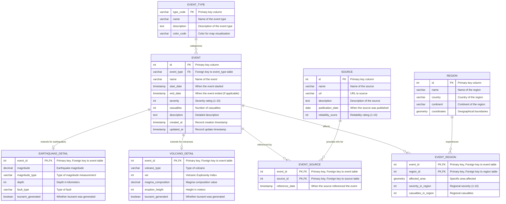

# Database Schema for Geoscoping

This document outlines the PostgreSQL database schema design for the Geoscoping application, focusing on storing geological events, geographic regions, and information sources.

## ER Diagram

**Note:** In Mermaid's ER diagram syntax, each entity is represented as a box with its name at the top, and each row inside the box represents a column in that database table.



## SQL Schema Definition

Below are the SQL commands to create the tables. Each CREATE TABLE statement defines a table with columns that match the ER diagram above.

```sql
-- Event Types
CREATE TABLE event_type (
    type_code VARCHAR(20) PRIMARY KEY,
    name VARCHAR(100) NOT NULL,
    description TEXT,
    color_code VARCHAR(7) -- for map visualization (hex color code)
);

-- Regions
CREATE TABLE region (
    id SERIAL PRIMARY KEY,
    name VARCHAR(100) NOT NULL,
    country VARCHAR(100),
    continent VARCHAR(50),
    coordinates GEOMETRY(POLYGON) -- PostGIS extension required
);

-- Information Sources
CREATE TABLE source (
    id SERIAL PRIMARY KEY,
    name VARCHAR(200) NOT NULL,
    url VARCHAR(500),
    description TEXT,
    publication_date DATE,
    reliability_score INT CHECK (reliability_score BETWEEN 1 AND 10)
);

-- Main Events Table
CREATE TABLE event (
    id SERIAL PRIMARY KEY,
    event_type VARCHAR(20) NOT NULL REFERENCES event_type(type_code),
    name VARCHAR(200) NOT NULL,
    start_date TIMESTAMP NOT NULL,
    end_date TIMESTAMP, -- NULL for ongoing or instantaneous events
    severity INT CHECK (severity BETWEEN 1 AND 10),
    casualties INT,
    description TEXT,
    created_at TIMESTAMP DEFAULT CURRENT_TIMESTAMP,
    updated_at TIMESTAMP DEFAULT CURRENT_TIMESTAMP
);

-- Many-to-many relationship between Events and Regions
CREATE TABLE event_region (
    event_id INT REFERENCES event(id) ON DELETE CASCADE,
    region_id INT REFERENCES region(id) ON DELETE CASCADE,
    affected_area GEOMETRY(POLYGON), -- specific area affected within region
    severity_in_region INT CHECK (severity_in_region BETWEEN 1 AND 10),
    casualties_in_region INT,
    PRIMARY KEY (event_id, region_id)
);

-- Many-to-many relationship between Events and Sources
CREATE TABLE event_source (
    event_id INT REFERENCES event(id) ON DELETE CASCADE,
    source_id INT REFERENCES source(id) ON DELETE CASCADE,
    reference_date TIMESTAMP,
    PRIMARY KEY (event_id, source_id)
);

-- Specific details for Volcano events
CREATE TABLE volcano_detail (
    event_id INT PRIMARY KEY REFERENCES event(id) ON DELETE CASCADE,
    volcano_type VARCHAR(50),
    vei INT, -- Volcanic Explosivity Index
    magma_composition DECIMAL,
    eruption_height INT, -- in meters
    tsunami_generated BOOLEAN DEFAULT FALSE
);

-- Specific details for Earthquake events
CREATE TABLE earthquake_detail (
    event_id INT PRIMARY KEY REFERENCES event(id) ON DELETE CASCADE,
    magnitude DECIMAL(4,2) NOT NULL,
    magnitude_type VARCHAR(20), -- e.g., "Richter", "Moment Magnitude"
    depth INT, -- in kilometers
    fault_type VARCHAR(50),
    tsunami_generated BOOLEAN DEFAULT FALSE
);

-- Specific details for Wildfire events
CREATE TABLE wildfire_detail (
    event_id INT PRIMARY KEY REFERENCES event(id) ON DELETE CASCADE,
    area_burned DECIMAL(12,2),
    area_unit VARCHAR(10), -- e.g., "hectares", "acres"
    cause VARCHAR(100),
    containment_percent INT CHECK (containment_percent BETWEEN 0 AND 100),
    vegetation_type VARCHAR(100)
);

-- Indexes for performance
CREATE INDEX idx_event_type ON event(event_type);
CREATE INDEX idx_event_date ON event(start_date);
CREATE INDEX idx_event_severity ON event(severity);
CREATE INDEX idx_region_name ON region(name);
CREATE INDEX idx_region_geo ON region USING GIST(coordinates);
CREATE INDEX idx_event_region_geo ON event_region USING GIST(affected_area);
```

## Initial Data Setup

```sql
-- Populate Event Types
INSERT INTO event_type (type_code, name, description, color_code) VALUES
('VOLCANO', 'Volcano', 'Volcanic eruptions and related activity', '#FF4500'),
('QUAKE', 'Earthquake', 'Seismic events and ground movement', '#FF8C00'),
('WILDFIRE', 'Wildfire', 'Uncontrolled fires in natural areas', '#CD5C5C');

-- Future event types can be added as:
-- INSERT INTO event_type (type_code, name, description, color_code) VALUES
-- ('FLOOD', 'Flood', 'Water overflow from water bodies', '#1E90FF'),
-- ('TSUNAMI', 'Tsunami', 'Series of ocean waves caused by an underwater disturbance', '#00BFFF'),
-- ('LIGHTNING', 'Lightning', 'Electrical discharge during storms', '#FFFF00');
```

## Design Considerations

### Extensibility

- The schema uses a base `event` table with common attributes
- Event-specific details are stored in separate tables (e.g., `volcano_detail`, `earthquake_detail`)
- New event types can be easily added by:
  1. Adding a new entry in the `event_type` table
  2. Creating a new detail table for the specific event type

### Historical Data Support

- The `start_date` and `end_date` fields can accommodate events from any time period
- No artificial limitations on date ranges, supporting pre-historic events
- The schema can store events with varying levels of precision and certainty

### Performance Considerations

- Indexes on frequently queried fields
- Spatial indexes using PostGIS for geographic queries
- Separation of core event data from type-specific details to optimize common queries

### Relationships

- Many-to-many relationship between events and regions
- Many-to-many relationship between events and sources
- One-to-one relationship between events and their type-specific details

This schema provides a solid foundation for the Geoscoping application while allowing for future expansion as outlined in the requirements.
