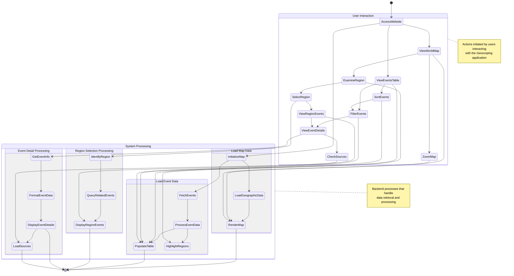

## Activity Diagram

Flow of operations or actions within a particular function or process. Including actions like user inputs, data processing, decision-making, loops, and end states.

#### Install `bierner.markdown-mermaid` extension from VS Code to view the graph.

Open with: `Ctrl+Shift+V`

### Activity Flow Description

This activity diagram illustrates the flow of operations in the Geoscoping system, particularly focusing on how geological event data is processed and presented to users.

#### User Interaction Flow

1. **Access Website**

   - User navigates to the Geoscoping.com website

2. **View Options**

   - User can choose to start by viewing the world map or events table

3. **Map Interaction**

   - **View World Map**: User views the interactive global map
   - **Zoom Map**: User can zoom in/out to focus on different areas
   - **Examine Region**: User can hover over shaded regions to see basic information
   - **Select Region**: User clicks on a region of interest

4. **Table Interaction**

   - **View Events Table**: User accesses tabular data of all geological events
   - **Sort Events**: User sorts data by severity, casualties, region, or time frame
   - **Filter Events**: User narrows down events based on criteria

5. **Detailed Information**
   - **View Region Events**: User sees events specific to a selected map region
   - **View Event Details**: User accesses comprehensive event information
   - **Check Sources**: User reviews sources of the event information

#### System Processing Flow

1. **Map Data Processing**

   - **Initialize Map**: System begins loading the interactive map
   - **Load Geographic Data**: System retrieves geographical information
   - **Render Map**: System displays the interactive map with shaded regions

2. **Event Data Processing**

   - **Fetch Events**: System retrieves geological event data from the database
   - **Process Event Data**: System organizes and prepares event information
   - **Populate Table**: System fills the events table with data
   - **Highlight Regions**: System shades regions on the map based on events

3. **Region Selection Processing**

   - **Identify Region**: System determines which region was selected
   - **Query Related Events**: System finds events associated with the region
   - **Display Region Events**: System shows events specific to that region

4. **Event Detail Processing**
   - **Get Event Info**: System retrieves comprehensive data for a specific event
   - **Format Event Data**: System prepares the data for presentation
   - **Display Event Details**: System shows detailed event information
   - **Load Sources**: System retrieves and displays information sources

This diagram captures both the user-facing actions and the underlying system processes that occur when users interact with the Geoscoping application to explore geological events.
