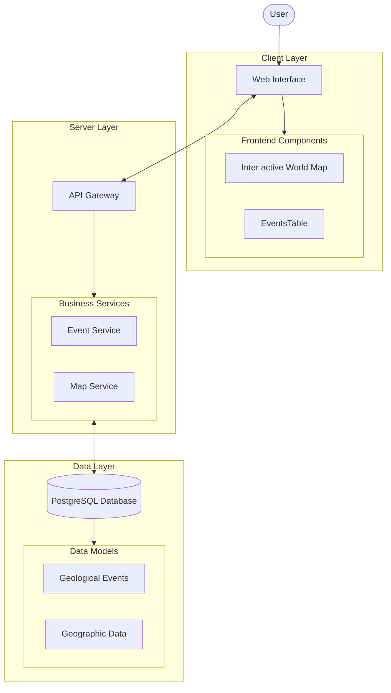

# Application Diagram

This diagram illustrates the architecture of the Geoscoping application, showing how different components interact with each other.

#### Install `bierner.markdown-mermaid` extension from VS Code to view the graph.

Open with: `Ctrl+Shift+V`

## Component Description

### Client Layer

- **Web Interface**: Main user-facing application
- **Interactive World Map**: Displays geological events with regional shading
- **Events Table**: Lists events with sorting by severity, casualties, region, time frame
- **Region Details View**: Shows detailed information when a region is clicked
- **Information Sources Display**: Shows data sources for each event

### Server Layer

- **API Gateway**: Handles all client requests and routes them appropriately
- **Authentication Service**: Manages authentication and authorization for protected endpoints
- **Event Service**: Manages geological event data (volcanoes, earthquakes, wildfires)
- **Map Service**: Processes geographic data for the interactive map

### Data Layer

- **PostgreSQL Database**: Stores all application data
  - **Geological Events**: Data about natural events, including type, severity, casualties, etc.
  - **Geographic Data**: Map information and region coordinates

## Data Flow

1. Users interact with the Web Interface
2. Client requests are sent to the API Gateway
3. The API Gateway authenticates requests via the Authentication Service
4. Business Services process requests and interact with the database
5. Response data is sent back to the client for display

## Future Considerations

- Integration with Neo4j database for event connections
- Addition of historical data going back to pre-historic times
- Support for additional event types (floods, tsunamis, lightning)
