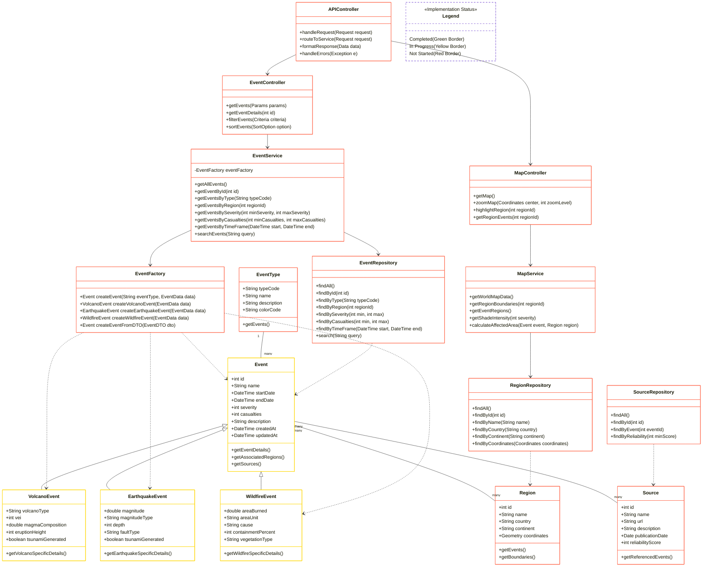

## Class Diagram

The structure of your system in terms of classes, their attributes, methods, and relationships (e.g., inheritance, association).

#### Install `bierner.markdown-mermaid` extension from VS Code to view the graph.

Open with: `Ctrl+Shift+V`

## Class Diagram Description

This class diagram illustrates the structure of the Geoscoping application, showing the key classes, their attributes, methods, and relationships. The diagram is organized into several logical sections:

### Domain Models

These classes represent the core business entities of the application:

- **Event**: Base class for all geological events with common properties
  - **VolcanoEvent**: Specialized class for volcanic events
  - **EarthquakeEvent**: Specialized class for earthquake events
  - **WildfireEvent**: Specialized class for wildfire events
- **EventType**: Categorizes events (volcano, earthquake, wildfire)
- **EventFactory**: Creates appropriate event instances based on type (Factory Pattern)
- **Region**: Geographic areas affected by events
- **Source**: Information sources referenced for event data

### Service Layer

These classes implement the business logic:

- **EventService**: Manages event data retrieval and processing
- **MapService**: Handles geographic data and map rendering operations

### Controllers

These classes handle requests and coordinate application flow:

- **APIController**: Central entry point that routes all client requests
- **EventController**: Handles event-specific operations
- **MapController**: Manages map-related operations

### Data Access

These classes manage database interactions:

- **EventRepository**: Data access for events
- **RegionRepository**: Data access for geographic regions
- **SourceRepository**: Data access for information sources

### Key Relationships

1. **Inheritance**:

   - Specific event types (Volcano, Earthquake, Wildfire) inherit from the base Event class

2. **Factory Pattern**:

   - The EventFactory creates appropriate event instances based on the event type
   - This improves extensibility by centralizing event creation logic
   - New event types can be added by extending the factory without modifying client code

3. **Associations**:

   - Many-to-many relationships between events and regions
   - Many-to-many relationships between events and sources
   - One-to-many relationship between event types and events

4. **Dependencies**:
   - EventService depends on EventFactory for creating events
   - Services depend on Repositories
   - Controllers depend on Services
   - Repositories work with Domain Models

### Factory Pattern Benefits

The Event Factory pattern provides several advantages:

1. **Encapsulation**: Hides the instantiation logic from client code
2. **Centralized Creation**: Single point for creating different event types
3. **Extensibility**: New event types can be added by updating the factory without changing client code
4. **Simplified Client Code**: Services just request an event of a certain type without needing to know creation details

### Implementation Status

The class diagram uses color coding to indicate the implementation status of each class:

- **Green**: Completed classes
- **Orange**: Classes in progress (Event, VolcanoEvent, EarthquakeEvent, WildfireEvent)
- **Red**: Classes not yet started

This visual indication helps track the development progress of the system components.

This class structure supports the requirements for displaying geological events on an interactive map with the ability to filter, sort, and view detailed information about events and their sources.
