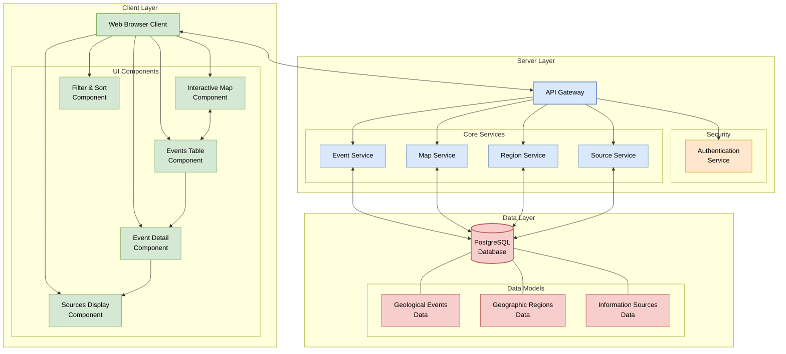

# Component Diagram

This diagram illustrates the key components of the Geoscoping system and their interactions, showing how the various software elements work together to fulfill the system requirements.

#### Install `bierner.markdown-mermaid` extension from VS Code to view the graph.

Open with: `Ctrl+Shift+V`

## Component Description

### Client Layer

- **Web Browser Client**: The main entry point for users accessing the Geoscoping application
- **UI Components**:
  - **Interactive Map Component**: Displays the world map with shaded regions, supports zooming
  - **Events Table Component**: Shows tabular data of geological events
  - **Filter & Sort Component**: Allows filtering and sorting events by severity, casualties, region, and time frame
  - **Event Detail Component**: Displays comprehensive information about a selected event
  - **Sources Display Component**: Shows information sources for events

### Server Layer

- **API Gateway**: Central entry point for all client requests, routes to appropriate services
- **Security**:
  - **Authentication Service**: Handles authentication for protected endpoints
- **Core Services**:
  - **Event Service**: Manages geological event data (volcanos, earthquakes, wildfires)
  - **Map Service**: Handles map rendering and geographic data processing
  - **Region Service**: Manages region-specific data and operations
  - **Source Service**: Handles information source retrieval and management

### Data Layer

- **PostgreSQL Database**: Stores all application data
- **Data Models**:
  - **Geological Events Data**: Information about natural disasters
  - **Geographic Regions Data**: Map regions and coordinates
  - **Information Sources Data**: References and citations for event information

## Key Interactions

1. The Web Client communicates with the API Gateway for all data requests
2. API requests pass through Authentication Service for protected endpoints
3. Core Services process client requests and interact with the database
4. UI Components interact with each other (e.g., clicking a map region updates the table)
5. All data persistence happens through the PostgreSQL database

This architecture supports the functional requirements while maintaining a clear separation of concerns and adhering to the non-functional requirements of an object-oriented backend with protected endpoints.
