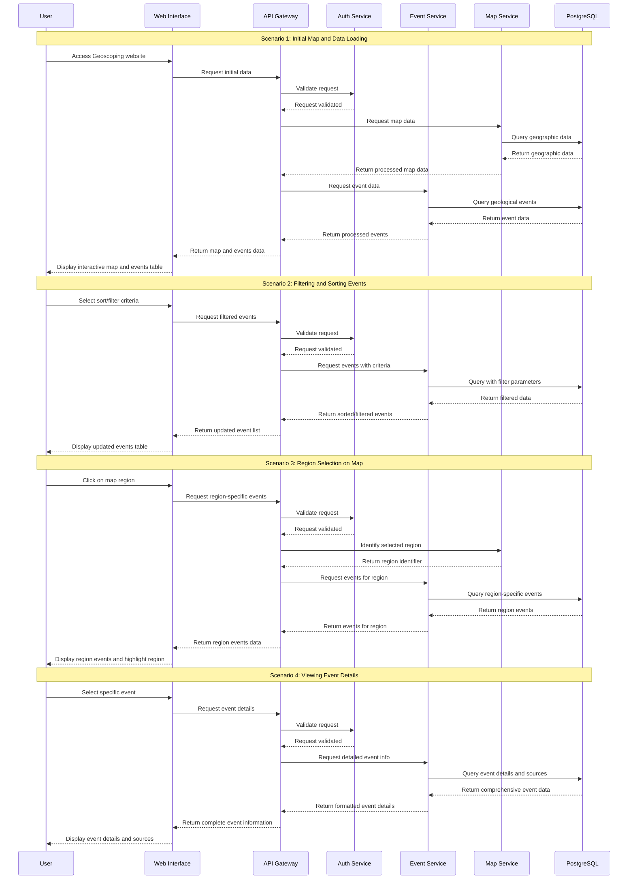

## Swimlane Diagram

Illustrates how different actors or components (such as users, systems, or microservices) interact over time.

#### Install `bierner.markdown-mermaid` extension from VS Code to view the graph.

Open with: `Ctrl+Shift+V`

### Swimlane Diagram Description

This diagram illustrates the interactions between different components of the Geoscoping system across four key scenarios:

#### Components

- **User**: End user of the Geoscoping application
- **Web Interface**: Frontend that displays maps and tables
- **API Gateway**: Central entry point for all client requests
- **Auth Service**: Handles authentication for protected endpoints
- **Event Service**: Processes geological event data
- **Map Service**: Handles geographic data and map rendering
- **PostgreSQL**: Database storing all application data

#### Scenario 1: Initial Map and Data Loading

Shows the sequence of interactions when a user first accesses the application:

1. User accesses the website
2. System loads and renders the interactive map
3. System fetches and displays geological event data
4. User sees the complete interface with map and events table

#### Scenario 2: Filtering and Sorting Events

Demonstrates how the system processes user requests to organize data:

1. User selects sorting or filtering criteria (severity, casualties, region, time frame)
2. System processes the request and updates the events table
3. User sees the reorganized data according to their preferences

#### Scenario 3: Region Selection on Map

Illustrates the connection between map interactions and event data:

1. User clicks on a specific region on the map
2. System identifies the region and finds associated events
3. System highlights the region and shows related event data
4. User sees events specific to their selected geographic area

#### Scenario 4: Viewing Event Details

Shows how detailed information is retrieved and presented:

1. User selects a specific geological event
2. System fetches comprehensive information about that event
3. System retrieves and formats the event's data sources
4. User sees detailed event information with supporting sources

This swimlane diagram provides a clear visualization of how components interact over time to fulfill the functional requirements of the Geoscoping system.
