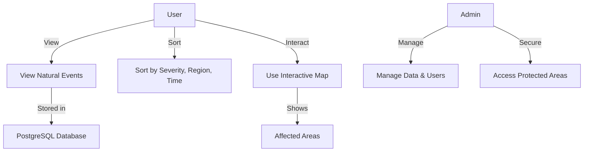

# Use Case Diagram

#### Install `bierner.markdown-mermaid` extension from VS Code to view the graph.

Open with: `Ctrl+Shift+V`

Visualizes the functional requirements of the system from a user's perspective.

# Use Case Diagram

