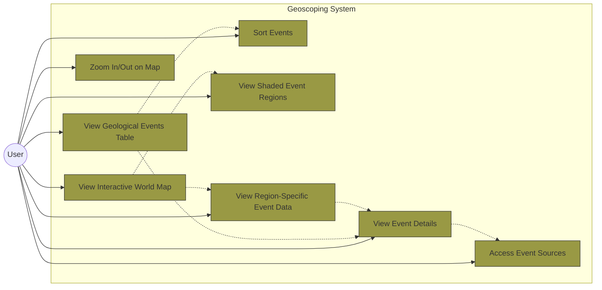

# Use Case Diagram

#### Install `bierner.markdown-mermaid` extension from VS Code to view the graph.

Open with: `Ctrl+Shift+V`

Visualizes the functional requirements of the system from a user's perspective.

## Use Case Descriptions

### Primary User Interactions

1. **View Interactive World Map**

   - User can access and view a global map showing geological events
   - Includes the ability to see shaded regions representing event areas

2. **Zoom In/Out on Map**

   - User can adjust the map view to focus on specific regions or get a broader overview

3. **View Geological Events Table**

   - User can access a tabular view of all geological events (volcanoes, earthquakes, wildfires)
   - Table displays key information about each event

4. **Sort Events**

   - User can organize events based on different criteria:
     - Severity of the event
     - Number of casualties
     - Geographic region
     - Time frame of occurrence

5. **View Event Details**

   - User can access comprehensive information about a specific geological event
   - Includes all recorded data points about the event

6. **View Shaded Event Regions**

   - User can see color-coded or otherwise visually distinguished areas on the map representing event locations

7. **Access Event Sources**

   - User can view the sources of information for any given event
   - Includes references, citations, or links to original data sources

8. **View Region-Specific Event Data**
   - User can click on a map region and be linked directly to corresponding event data in the table
   - Provides a geographic entry point to detailed information

## Relationships

- Viewing the world map includes the ability to see shaded regions and click on regions for details
- The events table is the foundation for sorting events and viewing detailed information
- Event details include access to information sources
- Clicking on map regions leads to viewing specific event details
